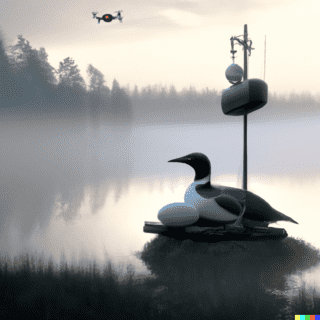

# birdnest

## what, why, how?

This is a pre-assignment project for the Reaktor's Developer Trainee, summer 2023 position. 
It's a fullstack web application, that displays a list, or in my case cards of drone pilots, who violated the no fly zone/no drone zone in the last 10 minutes. Drone and pilot data are fetched from endpoints provided by Reaktor. New violations will popup asynchronously, and old ones will be removed in the same manner. 

I used HTML/CSS/JS for the frontend, PHP for the backend, and MySQL for the database. Development was done on windows wampserver, and the deployed application is running on linux server. I'm currently learning MERN stack, but decided to do this project with the stack that I'm more familiar with (WAMP/LAMP). 

The full subject can be found <a href="https://assignments.reaktor.com/birdnest/" target="_blank">here</a>.

And the deployed app can be viewed live at <a href="https://kmoilane.com/birdnest" target="_blank">kmoilane.com/birdnest</a>.

I have set up a cronjob at my server which checks if api_caller.php is running and if not, it will run it. In api_caller.php there's an infinite loop that runs every 2 seconds, that gets the new snapshots of the drones, and handles the data received. This script keeps my database up to date, so that when ever someone enters the website, there will be up to date data from the last 10 minutes.

## Objective (briefly)

_"Build and deploy a web application which lists all the pilots who recently violated the NDZ perimeter."_

Now in HTML terms, I don't have a list. I first went with table, but decided to add the visualization of the
closest confirmed distances, so I ended up with violation cards instead.

### Requirements

-   [x] Persist the pilot information for 10 minutes since their drone was last seen by the equipment
-   [x] Display the closest confirmed distance to the nest
-   [x] Contain the pilot name, email address and phone number
-   [x] Immediately show the information from the last 10 minutes to anyone opening the application
-   [x] Not require the user to manually refresh the view to see up-to-date information
-   [x] Develop the application as if it was always operational
-   [x] Visualize the drone positions in some way (not required)
